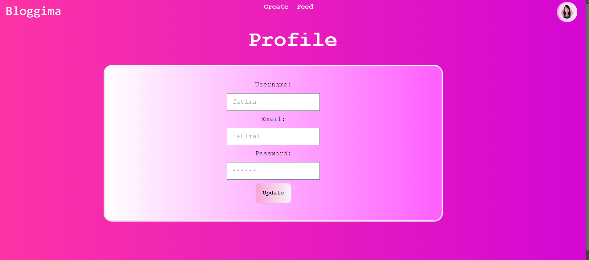

-------------------------- HOW TO RUN ------------------------
Go to backend folder by running cd src/Backend command and then run the backend by
npx nodemon connection.js command, this would run the database and server

For running the frontend you can stay in root folder and then use
npm run start command to run the frontend which would ppen automatically on your defaut browser

----------------------------FEATURES---------------------------
Sign up or Login

---

Admin side options

-Users list

-Blogs list

---

User side options

Upload Blog

Menu for sort and filters

View and open a blog

Update Profile

See notifications for comments and followings

Update a blog

Follow or delete a blog

and more.....
